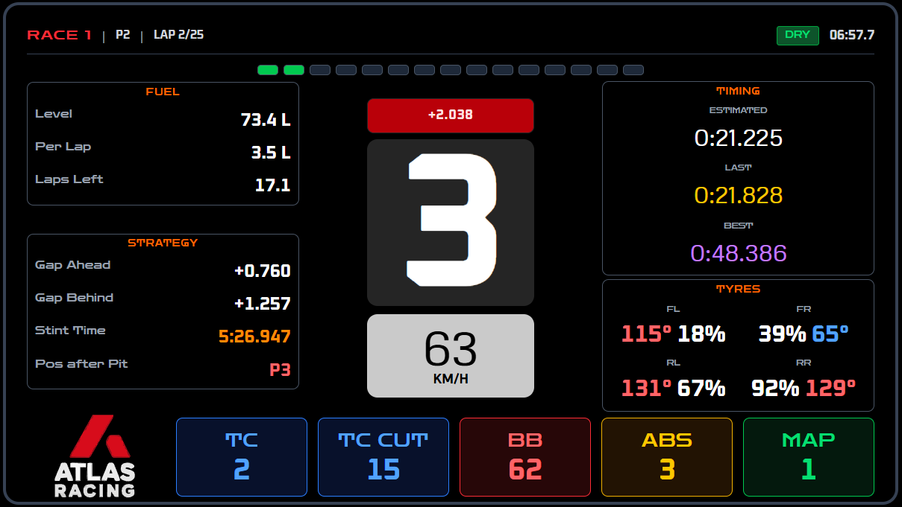

<p align="center">
  
</p>

<h3 align="center">Real-time sim racing telemetry with an AI Race Engineer</h3>

<p align="center">
  <a href="#quick-start">Quick Start</a> &bull;
  <a href="#features">Features</a> &bull;
  <a href="#supported-games">Games</a> &bull;
  <a href="#atlas-core">Atlas Core</a> &bull;
  <a href="#dashboards">Dashboards</a> &bull;
  <a href="#architecture">Architecture</a> &bull;
  <a href="#contributing">Contributing</a> &bull;
  <a href="#license">License</a>
</p>

<p align="center">
  
  
  
  
  
</p>

---

Atlas Racing is a **free, open-source** telemetry dashboard for sim racers. It captures live data from your game, displays it across professional-grade dashboards, and optionally connects to an **AI Race Engineer** that gives you real-time pit strategy, tyre advice, and tactical calls — just like a real pit wall.

<p align="center">
  
  <br/>
  <em>Endurance Dashboard — fuel, tyres, gaps, timing, and car settings at a glance</em>
</p>

## Quick Start

### Prerequisites

| Requirement | Details |
|-------------|---------|
| **OS** | Windows 10 or 11 |
| **Game** | EA Sports F1 24/25, Assetto Corsa, ACC, or ATS |
| **Node.js** | [v18 or later](https://nodejs.org/) |
| **OpenAI API key** | Optional — only needed for the AI Race Engineer |

### 1. Clone & install

```bash
git clone https://github.com/DhruvGoswami10/AtlasRacing-Product.git
cd AtlasRacing-Product

cd dashboard/frontend
npm install
```

### 2. Start the backend

```bash
# Pre-built binary (easiest):
cd dashboard/backend/build
./atlas_racing_server.exe

# Or build from source:
cd dashboard/backend
mkdir build && cd build
cmake .. && cmake --build . --config Release
./atlas_racing_server.exe
```

The backend listens on **port 8080** (SSE) and **port 20777** (UDP from F1 games).

### 3. Start the frontend

```bash
cd dashboard/frontend
npm start
```

Open **http://localhost:3000** in your browser. A built-in **Setup Guide** walks you through connecting your game on first launch.

### 4. Run Atlas Core (for AC/ACC/ATS and cross-device setups)

Atlas Core is a lightweight telemetry forwarder that can run on the same PC as Dashboard, or on another device on your LAN.

```bash
cd tools/atlas-core
build.bat
.\build\atlas-core.exe
```

Common use:
- **PC B** runs Atlas Core (where the game is running)
- **PC A** runs Dashboard (frontend + backend)
- Dashboard connects to PC B host via auto-discovery or manual host selection

Atlas Core endpoints:
- `http://<atlas-core-ip>:8080/telemetry`
- `http://<atlas-core-ip>:8080/api/info`
- `http://<atlas-core-ip>:8080/api/discover`

### 5. Configure your game

<details>
<summary><strong>F1 24 / F1 25</strong></summary>

1. Open the game → **Settings** → **Telemetry Settings**
2. **UDP Telemetry**: On
3. **UDP Port**: 20777
4. **UDP Format**: 2024 (or 2025)
5. **UDP Send Rate**: 60 Hz
6. **UDP IP Address**: 127.0.0.1

</details>

<details>
<summary><strong>Assetto Corsa</strong></summary>

Atlas Racing reads AC telemetry via **shared memory** — no extra configuration needed. Just start a session and the data flows automatically through the AtlasLink bridge.

</details>

<details>
<summary><strong>ACC / ATS</strong></summary>

Use **Atlas Core** to read shared memory and forward telemetry.

</details>

### 6. (Optional) Enable AI Race Engineer

Create a `.env.local` file in `dashboard/frontend/`:

```env
REACT_APP_OPENAI_API_KEY=sk-your-key-here
REACT_APP_OPENAI_MODEL=gpt-4o-mini
```

The AI features are entirely optional. Everything else works without an API key.

---

## Features

| Feature | Description |
|---------|-------------|
| **Live Telemetry** | Tyre wear, fuel, ERS, lap times, gaps, weather — all in real time via UDP/shared memory |
| **AI Race Engineer** | LLM-powered strategist providing pit strategy, ERS management, and tactical advice |
| **Broadcasting Engine** | Automated race event detection — safety cars, battles, weather changes, tyre warnings (16 event types) |
| **Atlas Core Bridge** | Lightweight AC/ACC/ATS forwarder with `/telemetry`, `/api/info`, `/api/discover`, and LAN discovery beacon |
| **5 Dashboards** | F1 Pro, Endurance, Live Analysis, Race Director, and Dev Mode |
| **Multi-Game** | F1 24/25 (UDP), Assetto Corsa, ACC, and ATS |
| **Voice System** | Whisper STT + Edge-TTS / ElevenLabs for hands-free interaction |

---

## Supported Games

| Game | Status | Connection |
|------|--------|------------|
| EA Sports F1 24 | Fully supported | UDP port 20777 |
| EA Sports F1 25 | Fully supported | UDP port 20777 |
| Assetto Corsa | Fully supported | Shared memory (AtlasLink or Atlas Core) |
| Assetto Corsa Competizione (ACC) | Supported via Atlas Core | Shared memory -> Atlas Core |
| American Truck Simulator (ATS) | Supported via Atlas Core | Shared memory -> Atlas Core |
| iRacing, rFactor 2 | Planned | — |

---

## Atlas Core

Atlas Core is the lightweight telemetry forwarder used when games do not emit native UDP telemetry (or when you want clean cross-device forwarding).

Key behavior:
- Detects supported games and reads shared memory
- Forwards telemetry over HTTP SSE
- Supports LAN auto-discovery (`/api/discover` + UDP beacon on `20780`)
- Exposes health/info endpoint (`/api/info`)

Quick run:

```bash
cd tools/atlas-core
.\build\atlas-core.exe --sse-port 8080
```

---

## Dashboards

<table>
<tr>
<td width="50%">

### F1 Dashboard
Grid-based layout with sector timing bars, ERS & DRS integration, tyre compound display, and pit window status. Professional F1 broadcast styling.

</td>
<td width="50%">

### Endurance Dashboard
Clean GT racing interface with central gear display, RPM lights, input monitoring, and tyre temps. Built for long stints.

</td>
</tr>
<tr>
<td>

### Live Race Analysis
Full telemetry view with lap deltas, tyre temps/wear, steering traces, and trend charts. No AI dependencies — pure data.

</td>
<td>

### Race Director
Multi-view board with leaderboard, track map, telemetry traces, and tyre status in a GT-style layout.

</td>
</tr>
<tr>
<td colspan="2">

### Dev Mode
Raw telemetry viewer showing every field the backend sends. Useful for development, debugging, and building new dashboards.

</td>
</tr>
</table>

## Architecture

```
F1 24/25 Game ──UDP :20777──────► C++ Backend ──SSE :8080──► React Dashboard
AC/ACC/ATS ──shared memory──► Atlas Core ──SSE :8080──────► (selected backend host)
                                           └─ /api/info /api/discover + beacon :20780
                                                             │
                                                             ▼
                                                     AI Race Engineer
                                                      (OpenAI GPT)
```

### Project Structure

```
atlas-racing/
├── dashboard/
│   ├── backend/             # C++17 telemetry server (UDP parsing, SSE streaming)
│   ├── frontend/            # React 18 + TypeScript dashboard
│   │   └── src/
│   │       ├── components/  # Dashboard components (50+)
│   │       ├── services/    # LLM engineer, broadcasting engine, SSE client
│   │       ├── context/     # React context (auth, telemetry)
│   │       └── hooks/       # Custom hooks
│   └── integrations/        # Game bridges (AtlasLink for Assetto Corsa)
├── tools/atlas-core/        # Lightweight shared-memory forwarder (AC/ACC/ATS)
├── tester/                  # Packet recorder/replayer for testing
├── tools/                   # Utility scripts
└── docs/                    # Documentation and roadmap
```

### Tech Stack

| Layer | Technology |
|-------|-----------|
| Backend | C++17, CMake, MSYS2/MinGW64 |
| Frontend | React 18, TypeScript, Tailwind CSS, Radix UI |
| State | Zustand, React Context |
| AI | OpenAI GPT-4o-mini (extensible to other providers) |
| Voice | Whisper STT, Edge-TTS, ElevenLabs |
| Streaming | Server-Sent Events (SSE) |
| Desktop | Electron (optional packaging) |

---

## Configuration

All configuration is via environment variables in `dashboard/frontend/.env.local`:

| Variable | Description | Required |
|----------|-------------|----------|
| `REACT_APP_OPENAI_API_KEY` | OpenAI API key for AI Race Engineer | No |
| `REACT_APP_OPENAI_MODEL` | LLM model (default: `gpt-4o-mini`) | No |
| `REACT_APP_SUPABASE_URL` | Supabase URL for cloud features | No |
| `REACT_APP_SUPABASE_ANON_KEY` | Supabase anon key | No |

Without Supabase configured, the app runs in **standalone mode** — no sign-up required.

---

## Troubleshooting

<details>
<summary><strong>Dashboard says "Disconnected"</strong></summary>

The C++ backend isn't running. Start it with:
```bash
cd dashboard/backend/build
./atlas_racing_server.exe
```
The frontend auto-reconnects once the backend is up.

</details>

<details>
<summary><strong>Backend is running but no data appears</strong></summary>

1. Make sure your game is running and you're in a session (not the main menu).
2. For F1 games: check that UDP Telemetry is set to **On** with port **20777**.
3. For AC/ACC/ATS via Atlas Core: verify Dashboard host is set to the Atlas Core device IP.
4. Validate endpoints from Dashboard device:
   - `http://<atlas-core-ip>:8080/api/info`
   - `http://<atlas-core-ip>:8080/telemetry`

</details>

<details>
<summary><strong>AI Race Engineer isn't responding</strong></summary>

1. Check that `REACT_APP_OPENAI_API_KEY` is set in `dashboard/frontend/.env.local`.
2. Verify your API key is valid and has credits.
3. Restart the frontend after changing `.env.local`.

</details>

<details>
<summary><strong>"npm start" fails</strong></summary>

1. Make sure you have Node.js 18+ installed: `node --version`
2. Run `npm install` in the `dashboard/frontend` directory.
3. Delete `node_modules` and `package-lock.json`, then run `npm install` again.

</details>

---

## Contributing

We welcome contributions! See [CONTRIBUTING.md](CONTRIBUTING.md) for development setup, code style guidelines, and the PR process.

- **Bug reports**: Use the [Bug Report](../../issues/new?template=bug_report.md) template
- **Feature requests**: Use the [Feature Request](../../issues/new?template=feature_request.md) template
- **Questions**: Open a [Discussion](../../discussions)

---

## Roadmap

See [docs/PRODUCT_ROADMAP.md](docs/PRODUCT_ROADMAP.md) for the full roadmap. Current focus:

- **Phase 1** (current): Clean ship — dead code removal, component refactoring, onboarding, docs
- **Phase 2**: Quality & trust — tests, CI/CD, linting
- **Phase 3**: Accessibility — cross-platform, Docker, Electron installer, LLM provider flexibility
- **Phase 4**: Community — plugin system, more games, contributor tools

---

## License

MIT License — see [LICENSE](LICENSE) for details.

Built with passion for sim racing.
